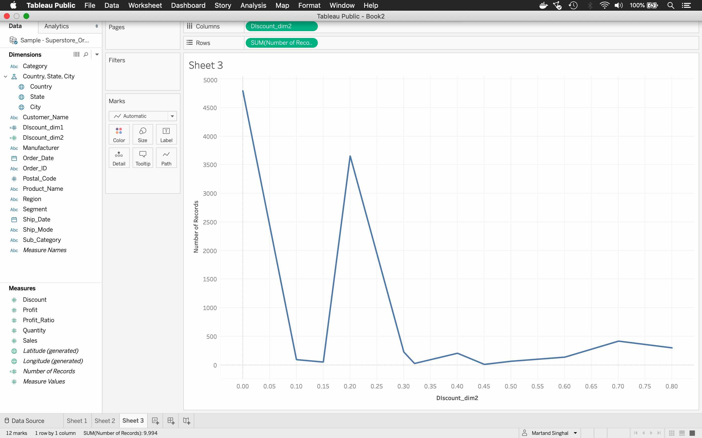

When I first started using Tableau, I was simultaneously creating the same visualization in R. This made my life much easier in navigating the initial learning curve of Tableau. Here, I am sharing my learnings that can help an R user to quickly start working with Tableau. Note that this article uses the Tidyverse package.

## The first (naive) step
Let's start with this [data set](https://drive.google.com/file/d/10ye7OXYq-THOJMDWM-qpKQAcBmGU_aFK/view?usp=sharing) and [connect it to Tableau](https://help.tableau.com/current/pro/desktop/en-us/examples_excel.htm). This is how the data looks like inside Tableau:


On giving a closer look we see that their is a '#' sign on the top of the Sales and the Profit columns, this implies that Tableau recognizes the data type of these columns as numeric. Similarly, Tableau recognizes the Category column as the type string (an 'Abc' sign) and Ship_Date column as the data type date (a calendar sign). The City and State columns are recognized as geographic data types.

Now let's go to the Sheet 1 tab, notice in the Data pane that Tableau has divided the fields in Dimensions and Measures as highlighted below (Tableau refers to the variables/columns as fields).


Now let's draw our first visualization by dragging the Profit field on the 'Text' property in the 'Marks' card and Region on the 'Rows' shelf.


The resulting visualization is a table with 4 rows. There are few things that stands out:
1. What are these numbers displayed inside the table?
2. Once we dropped the field on the Text property, why does it say Sum(Profit) below the Marks card?
3. Why does it say 4 marks at the bottom-left of the sheet? 

For the numbers in the table, the best guess we can make is that Tableau is showing the total profit in each region. We can confirm this hypothesis by calculating it in R. But before we move to R, let's also drop the field Segment in the Rows shelf and see what happens.


The new visualization is a table with 12 rows. Also note that the bottom-left now displays 12 marks. If we continue our guess work, then Tableau is probably showing the total profit by region and segment. Let's do some quick data processing in R to understand what's going on. 

## Investigating the first step in R
We start by loading the packages and the data file.

``` r
library(readxl)
library(tidyverse)
superstores_orders_tbl <- read_xls("~/Documents/website/Blog_code/Tableau_for_data_scientists_part_1/Sample - Superstore_Orders.xls")
```

Let's look at the dataset to see if everything is read correctly by R.

``` r
superstores_orders_tbl
```

```
## # A tibble: 9,994 x 20
##    Sales Profit Category City  Country Customer_Name Discount Manufacturer
##    <dbl>  <dbl> <chr>    <chr> <chr>   <chr>            <dbl> <chr>       
##  1   262     42 Furnitu… Hend… United… Claire Gute       0    Bush        
##  2   732    220 Furnitu… Hend… United… Claire Gute       0    Hon         
##  3    15      7 Office … Los … United… Darrin Van H…     0    Universal   
##  4   958   -383 Furnitu… Fort… United… Sean O'Donne…     0.45 Bretford    
##  5    22      3 Office … Fort… United… Sean O'Donne…     0.2  Eldon       
##  6    49     14 Furnitu… Los … United… Brosina Hoff…     0    Eldon       
##  7     7      2 Office … Los … United… Brosina Hoff…     0    Newell      
##  8   907     91 Technol… Los … United… Brosina Hoff…     0.2  Mitel       
##  9    19      6 Office … Los … United… Brosina Hoff…     0.2  DXL         
## 10   115     34 Office … Los … United… Brosina Hoff…     0    Belkin      
## # … with 9,984 more rows, and 12 more variables: Order_Date <dttm>,
## #   Order_ID <chr>, Postal_Code <dbl>, Product_Name <chr>, Profit_Ratio <dbl>,
## #   Quantity <dbl>, Region <chr>, Segment <chr>, Ship_Date <dttm>,
## #   Ship_Mode <chr>, State <chr>, Sub_Category <chr>
```

Next, we group the data by Region and sum the Profit for each Region using group_by and summarize.

``` r
superstores_orders_tbl %>% 
    group_by(Region) %>%
    summarize(Sum_Profit = sum(Profit))
```

    ## # A tibble: 4 x 2
    ##   Region  Sum_Profit
    ##   <chr>        <dbl>
    ## 1 Central      39719
    ## 2 East         91521
    ## 3 South        46721
    ## 4 West        108386

Aha! Our intuition was correct. Tableau is displaying the total profit split over different regions. Now, let's calculate the total Profit split over Region and Segment by utilizing group_by and summarize again.

``` r
superstores_orders_tbl %>% 
    group_by(Region, Segment) %>%
    summarize(Sum_Profit = sum(Profit)) %>% 
    ungroup()
```

```
## # A tibble: 12 x 3
##    Region  Segment     Sum_Profit
##    <chr>   <chr>            <dbl>
##  1 Central Consumer          8571
##  2 Central Corporate        18710
##  3 Central Home Office      12438
##  4 East    Consumer         41203
##  5 East    Corporate        23616
##  6 East    Home Office      26702
##  7 South   Consumer         26910
##  8 South   Corporate        15207
##  9 South   Home Office       4604
## 10 West    Consumer         57429
## 11 West    Corporate        34432
## 12 West    Home Office      16525
```
This result also matches with Tableau. 

> But why is Tableau splitting the total Profit over Region and Segment?
This is because Tableau uses Dimensions to 'group_by' the data and Measures to 'summarize'.
We can verify in the Data pane that Tableau identifies Region and Segment as Dimensions, and Profit as a Measure. 

How does Tableau know which field is a Dimension and which field is a Measure? Tableau identifies Dimensions and Measures based on the data type of the fields. A Numeric field is identified as a Measure and a field of type string is identified as a Dimension. A field of type date is also identified as a Dimension.

### Converting Measures into Dimensions and vice-versa
Tableau automatically assigns every field either a role of a Dimension or a Measure. However, depending on the visualization that we want to create, we may need to change the role of a field. To decide on what role a field is required to assume, we can think of what data processing steps we would need to perform in order to make the same visualization in R. If a field appears in the group_by function in R then it must be assigned a role of a Dimension in Tableau and if it appears in a summarize function is R then it must be assigned a role of a Measure.
To convert fields between Measures and Dimensions is straightforward, we can drag and drop the field in the appropriate area inside the Data pane or click on the field and convert it from the drop down menu.

In the last visualization we created, we made a second observation that Tableau displays Sum(Profit) below the Marks card. This happens due to the way Tableau's default behavior is set for Measures. Tableau automatically summarizes a Measure using a summary function whenever it is used in the visualization. When we dropped the Profit field on the Text property, the summary transformation resulted in a new field that Tableau labeled as Sum(Profit). The Sum(Profit) field is same as the 'Sum_Profit' variable we created in R. The summary function can be changed from sum to avg or to max or to other functions by clicking on the summarized field Sum(Profit) and hovering over 'Measure' in the drop down menu.

Another observation we made was about the number of marks displayed at the bottom-left. This number indicates the total number of rows in the summarized data. In the visualizations we created, the number of marks matches the number of rows in the corresponding summary data. However, [there are exceptions to this matching](https://help.tableau.com/current/pro/desktop/en-us/datafields_typesandroles.htm#how-dimensions-affect-the-level-of-detail-in-the-view). Note that the Dimensions used in the 'group_by' function directly control the number of rows in the summarized data. Thus, Dimensions control the number of marks.

### Terminology alert!
As we noticed before, Tableau uses its own lingo, such as, it refers to a variable as field and a visualization as view. So, for example, the tables we created in Tableau are views. Another terminology that we often hear is the level of detail. A Dimension's ability to control the number of marks is known as fixing the ***level of detail***. In addition, Tableau uses an umbrella term known as ***Aggregation*** or aggregate functions. These aggregate functions include the summary functions used in 'summarize' function in R. There are more aggregate functions than we use in 'summarize', but the discussion on those are out of the scope of this article. 

## Discrete or Continuous?
Tableau also has a concept of continuous and discrete fields. Tableau defines ***Continuous*** as *forming an unbroken whole, without interruption*; and ***Discrete*** as *individually separate and distinct*. The color of the field indicates whether a field is discrete (blue color) or continuous (green color). The blue and green colors **do not** indicate whether a field is a Measure or a Dimension. This confusion arises because usually (but not always), Measures are continuous and Dimensions are discrete.  

It is better to separate the concept of discrete and continuous from that of the Measures and Dimensions. To create a visualization, we should first decide whether a field should be a Measure or a Dimension and make the appropriate conversion if required. Deciding on whether we treat a field as continuous or discrete should be the second step. To further improve our understanding, let's make some visualizations in Tableau. Suppose that we are interested in finding how many times a particular amount of discount was offered (distribution of discount). We start by analyzing how we would achieve this in R.

``` r
superstores_orders_tbl %>% 
    group_by(Discount) %>% 
    summarize(Num_Records = sum(n()))
```

``` 
## # A tibble: 12 x 2
##    Discount Num_Records
##       <dbl>     <int>
##  1     0         4798
##  2     0.1         94
##  3     0.15        52
##  4     0.2       3657
##  5     0.3        227
##  6     0.32        27
##  7     0.4        206
##  8     0.45        11
##  9     0.5         66
## 10     0.6        138
## 11     0.7        418
## 12     0.8        300
```
From the R code we see that the Discount is in the group_by step. Therefore, we need to change the role of Discount from Measure to Discrete. To keep the Discount field as a Measure for the future use, we can make a copy of the Discount field and convert the copy into a Dimension. To make a copy, click on the Discount field inside the Data pane and select 'Duplicate'. Let's change the name of the copy to 'Discount_dim1' and convert it to a Dimension. This is how our Data pane looks like after creating the field.


Notice that the color of Discount_dim1 field is blue. This implies that when we changed the field to a Dimension, Tableau automatically converted the field to discrete. We can change it to continuous, but let's first analyze it as discrete. To make the bar chart, drop Discount_dim1 on Columns shelf and 'Number of Records' field on the Rows shelf. 


Voilà! We have our bar chart. Now let's experiment a bit more by making a copy of Discount_dim1 field. Rename the copied field as Discount_dim2 and convert the field to continuous by clicking on the field and selecting the appropriate option from the drop down menu.


Notice the color of the field is green now as it is a continuous field. Let's go to a new worksheet and make the bar chart again but this time with the continuous field.



Where is our bar chart? Since Discount_dim2 is a continuous dimension, Tableau makes a line chart by default. This can be changed to a bar chart by clicking on the drop down menu labeled 'Automatic' in the Marks card and selecting the bar chart.


This bar chart looks a bit different than the bar chart we made with the discrete field. The 2 bar charts highlight an important distinction between continuous and discrete fields. We note that the height of the bars are the same for the 2 charts. However, the distance between the consecutive bars is uneven for the second bar chart made with continuous Discount_dim2. Whereas for the bar chart we made with the discrete field, distance between any 2 consecutive bars is the same. Why is that? 

We have a data set that has 12 unique values for the Discount field. For a discrete Discount_dim1, it can take only these 12 distinct values and nothing in between these values. On the other hand, when we consider continuous Discount_dim2, it can take any value in between these values and beyond. It just so happened that our data set contains only 12 of such continuous values. Therefore, Discount_dim2 is drawn with an axis to emphasize that it can take any value. However, we can only draw 12 of these values as our data set does not provide us the information on the other possible values. 

The axis dictates the positioning of the data points for a continuous field. That's why the distance between the bars for Discount_dim2 is uneven. For the same reason, the relative positioning of the data points of a continuous field can not be changed independently. For example, for the bar chart drawn with Discount_dim2, we can not put the bar corresponding to the value of 0.2 to the left of the smaller values or to the right of the bigger values. 

On the other hand, for a discrete field, the relative positioning of the data points is not bound to an axis. Thus, we can sort a discrete field. We can see this in practice by sorting the discrete Discount_dim1 based on the number of records. If we hover over the label of the vertical axis then a bar chart icon would appear (see the highlighted area in red below). We can click on this icon to sort. 


Obviously, such sorting is not possible for the bar chart created with continuous Discount_dim2. The difference between discrete and continuous fields also impacts other aspects or our visualization, such as the Filter and the Color. A nice discussion on these aspects can be found [here](https://www.theinformationlab.co.uk/2011/09/23/blue-things-and-green-things/).

That's it for this post. In the future article of this series we will discuss a more advanced topic of Level of Detail expressions.